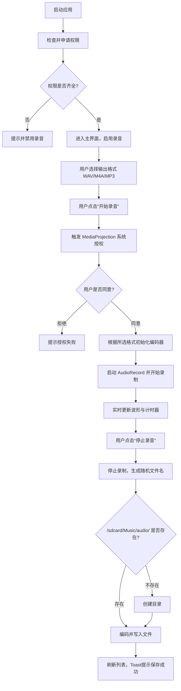
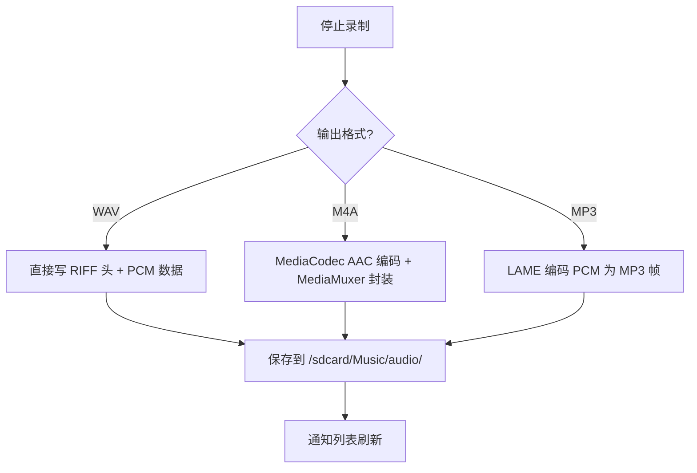
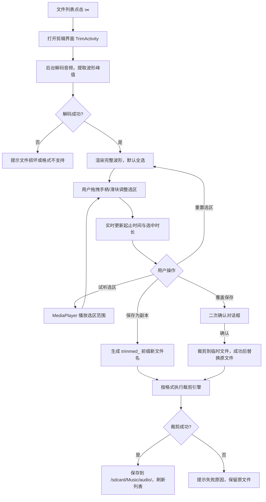
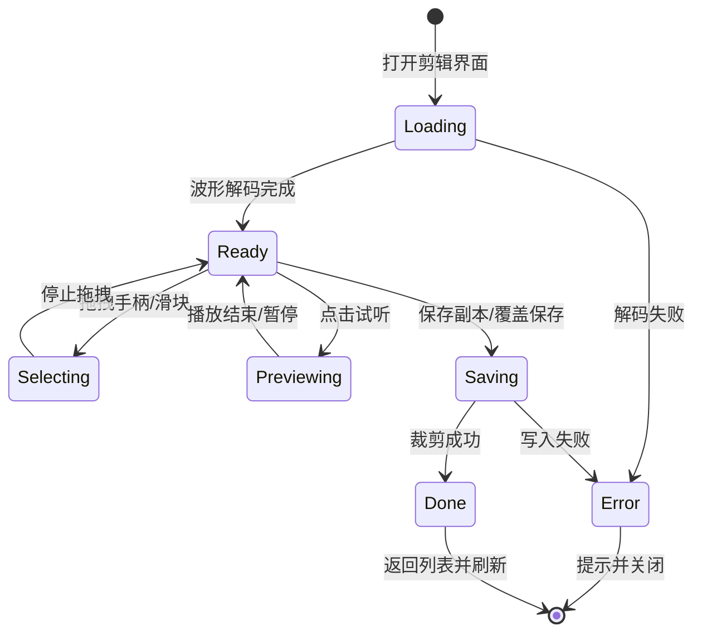

# Android 内部音频录制应用 —— 完整设计文档（支持 WAV / M4A / MP3 + 音频剪辑）

> 基于 Android 10 的 `AudioPlaybackCapture` API，实现内部音频录制。
> **支持输出格式**：无损 WAV、通用 AAC（M4A）、压缩 MP3。
> **内置音频剪辑**：波形拖拽裁剪头尾片段，支持副本/覆盖保存。
> 本设计文档涵盖需求、UI、流程、权限、编码选型及测试，可直接作为开发蓝本。

---

## 1. 引言

### 1.1 背景
Android 10 引入了 `AudioPlaybackCapture` API，允许应用捕获系统或其它应用播放的音频流（如游戏音效、音乐 App 播放的歌曲）。用户常需将录制内容用于剪辑或存档，因此**输出格式的多样性**至关重要。

### 1.2 目标
开发一款界面美观、功能完善的内部音频录制工具，核心特性：
- 一键开始/停止录制内部音频。
- **支持三种保存格式**：无损 WAV、高质量 M4A (AAC)、通用 MP3。
- **内置音频剪辑器**：波形可视化裁剪录音头尾片段。
- 自动生成随机文件名，保存至 `/sdcard/Music/audio/`。
- 支持用户重命名、播放、删除已保存文件。
- 实时波形反馈与计时。

---

## 2. 功能需求

| 功能模块 | 需求描述 |
|----------|----------|
| **格式选择** | 录制前可下拉选择输出格式：WAV（无损）、M4A（AAC）、MP3（压缩） |
| **音频剪辑** | 波形拖拽裁剪头尾，支持试听选区、保存副本或覆盖原文件 |
| 权限管理 | 动态申请 `RECORD_AUDIO`、存储权限，及 `MediaProjection` 系统授权 |
| 录音控制 | 开始/停止，计时器（HH:MM:SS），录制状态通知栏常驻 |
| 文件命名 | 自动命名：`recording_随机6位.扩展名`（扩展名随格式变化） |
| 文件存储 | 根目录 `/sdcard/Music/audio/`，不存在则自动创建 |
| 文件管理 | 列表展示所有音频文件，支持 **重命名**、**播放**、**剪辑**、**删除** |
| 界面反馈 | 实时音量波形动画，操作 Toast 提示，重命名对话框 |

---

## 3. 界面详细设计（含格式选择）

### 3.1 主界面布局（从上至下）

```text
+--------------------------------------------------+
|  🎵 Audio Capture                       ⚙️ 设置  |
+--------------------------------------------------+
|                                                  |
|          +--------------------------+            |
|          |   ▂▃▅▇▅▃▂  ▂▃▅▇▅▃▂       |            |  <- 实时波形（自定义View）
|          +--------------------------+            |
|                                                  |
|                ⏱️  00:00:00                      |  <- 计时器（等宽字体）
|                                                  |
|           输出格式： [ WAV ▼ ]                   |  <- 下拉选择框（WAV/M4A/MP3）
|                                                  |
|          +----------+   +----------+             |
|          |  ⏹ 停止  |   |  ● 录音  |             |  <- 圆形按钮，切换状态
|          +----------+   +----------+             |
|                                                  |
|    ━━━━━━━━━━ 录音列表 ━━━━━━━━━━                |
|    +----------------------------------------+    |
|    | 📄 recording_a3f9k7.wav  ✏️ ▶️ ✂️ 🗑️  |    |
|    +----------------------------------------+    |
|    | 📄 recording_b4d2x8.m4a  ✏️ ▶️ ✂️ 🗑️  |    |
|    +----------------------------------------+    |
|    | 📄 recording_c5e1y9.mp3  ✏️ ▶️ ✂️ 🗑️  |    |
|    +----------------------------------------+    |
+--------------------------------------------------+
```

### 3.2 界面元素说明

| 元素 | 描述 |
|------|------|
| **格式下拉框** | 位于计时器下方，提供三个选项：<br>• **WAV**：无压缩，音质最佳，文件最大。<br>• **M4A**：AAC 编码，通用性好，文件较小。<br>• **MP3**：最通用，兼容性极强，文件最小（需集成 LAME 库）。 |
| **按钮状态** | 点击“● 录音”时，根据当前下拉框的格式进行录制。录制过程中，**禁止切换格式**（下拉框置灰）。 |
| **文件操作** | 列表项右侧四个图标：✏️ 重命名、▶️ 播放、✂️ 剪辑、🗑️ 删除。 |
| **文件图标** | 列表中的文件图标根据扩展名显示不同颜色（WAV 蓝色、M4A 紫色、MP3 橙色），便于区分。 |

### 3.3 重命名对话框

```text
+----------------------------------+
|  重命名录音文件                   |
|  ┌────────────────────────────┐  |
|  │  recording_a3f9k7          │  |  <- 输入框（不含扩展名）
|  └────────────────────────────┘  |
|  扩展名 .wav 不可修改             |
|        [取消]    [确定]          |
+----------------------------------+
```

> 注：重命名时只能修改主文件名，扩展名固定为原格式。

---

## 4. 核心流程设计（Mermaid）

### 4.1 带格式选择的完整录音流程



### 4.2 不同格式的编码决策流程



---

## 5. 权限管理

### 5.1 所需权限清单

| 权限 | 用途 | 申请方式 |
|------|------|----------|
| `RECORD_AUDIO` | 录音必需 | 动态申请（危险权限） |
| `WRITE_EXTERNAL_STORAGE` | 保存文件（Android 10 及以下） | 动态申请 |
| `READ_EXTERNAL_STORAGE` | 读取文件列表 | 动态申请 |
| `FOREGROUND_SERVICE` | 后台持续录制 | 声明即可 |
| `FOREGROUND_SERVICE_MEDIA_PROJECTION` | MediaProjection 前台服务类型（API 34+） | 声明即可 |
| `POST_NOTIFICATIONS` | 录制状态通知（API 33+） | 动态申请 |

### 5.2 兼容性策略
- **Android 10（目标平台）**：使用 `Environment.getExternalStoragePublicDirectory(DIRECTORY_MUSIC)` + 传统 File API，Manifest 声明 `android:requestLegacyExternalStorage="true"`，`targetSdkVersion 29` 可完整保留传统存储行为。
- **Android 11+ / HarmonyOS**：系统强制执行分区存储，需申请 `MANAGE_EXTERNAL_STORAGE`（所有文件访问权限），点击录音时若未授权则弹窗引导用户前往系统设置开启。

### 5.3 权限拒绝处理
- `RECORD_AUDIO` 被拒：提示“无法录音，请前往设置开启权限”，录音按钮禁用。
- 存储权限被拒：提示“无法保存文件，请授予存储权限”。
- MediaProjection 被拒：提示“系统授权失败，无法录制内部音频”。

---

## 6. 三种音频格式技术实现对比

| 格式 | 编码方式 | 文件大小 | 音质 | Android 原生支持 | 实现方案 |
|------|----------|----------|------|------------------|----------|
| **WAV** | PCM 无压缩 | 极大（约 10MB/分钟） | 无损 | 完全支持 | 直接写入 PCM 数据，在文件头添加 RIFF 头信息即可。最简单。 |
| **M4A** | AAC (LC) | 较小（约 1MB/分钟） | 高 | 支持（MediaCodec） | 使用 `MediaCodec` 创建 AAC 编码器，通过 `MediaMuxer` 封装为 `.m4a`。 |
| **MP3** | MP3 (LAME) | 最小（约 0.7MB/分钟） | 良好 | 原生不支持编码 | 需集成第三方库（如 lame4android）或使用 FFmpeg。推荐集成 LAME 库进行软编码。 |

### 6.1 核心代码实现思路（Kotlin）

#### 6.1.1 获取 MediaProjection 授权

```kotlin
private val mediaProjectionManager by lazy {
    getSystemService(Context.MEDIA_PROJECTION_SERVICE) as MediaProjectionManager
}

fun startScreenCapture() {
    val intent = mediaProjectionManager.createScreenCaptureIntent()
    projectionLauncher.launch(intent)
}
```

#### 6.1.2 配置 AudioPlaybackCapture 并启动 AudioRecord

```kotlin
val audioConfig = AudioPlaybackCaptureConfiguration.Builder(mediaProjection)
    .addMatchingUsage(AudioAttributes.USAGE_MEDIA)
    .addMatchingUsage(AudioAttributes.USAGE_GAME)
    .addMatchingUsage(AudioAttributes.USAGE_UNKNOWN)
    .build()

val audioFormat = AudioFormat.Builder()
    .setEncoding(AudioFormat.ENCODING_PCM_16BIT)
    .setSampleRate(44100)
    .setChannelMask(AudioFormat.CHANNEL_IN_MONO)
    .build()

val bufferSize = AudioRecord.getMinBufferSize(
    44100, AudioFormat.CHANNEL_IN_MONO, AudioFormat.ENCODING_PCM_16BIT
)
audioRecord = AudioRecord.Builder()
    .setAudioPlaybackCaptureConfig(audioConfig)
    .setAudioFormat(audioFormat)
    .setBufferSizeInBytes(bufferSize * 2)
    .build()
audioRecord.startRecording()
```

#### 6.1.3 WAV 写入（流式 + 头部回填）

```kotlin
class WavWriter(file: File, sampleRate: Int = 44100) {
    // 打开文件时先写 44 字节占位头，录制中持续追加 PCM，
    // 结束时用 RandomAccessFile 回填 ChunkSize 与 Subchunk2Size
}
```

#### 6.1.4 M4A (AAC) 编码
1. 初始化 `MediaFormat` 为 `MIMETYPE_AUDIO_AAC`，配置 128kbps、44100Hz、单声道、AAC-LC。
2. 使用 `MediaCodec` 将 PCM 送入编码器，获取 AAC 帧。
3. 使用 `MediaMuxer` 将 AAC 帧写入 `.m4a` 容器。

#### 6.1.5 MP3 编码（集成 LAME）
1. 在 `build.gradle` 中引入 LAME 库（或自行编译 SO）。
2. 调用 `Lame.init()` 并配置参数（采样率、比特率 128kbps）。
3. 将 PCM 数据通过 `Lame.encode()` 转为 MP3 字节数组，直接写入 `.mp3` 文件。
4. 未集成时降级方案：提示用户并自动切换为 WAV 格式保存。

---

## 7. 文件存储与命名规则

- **存储根目录**：`Environment.getExternalStoragePublicDirectory(Environment.DIRECTORY_MUSIC) + "/audio/"`（即 `/sdcard/Music/audio/`）
- **目录创建**：首次保存时调用 `File.mkdirs()`
- **自动文件名**：`recording_` + 6 位随机（a-z0-9）+ `.` + 扩展名（根据所选格式）
  - 示例：`recording_x7k9m2.wav`、`recording_a3f9k7.m4a`、`recording_b4d2x8.mp3`
- **用户重命名**：仅修改主体，扩展名保持不变且不可编辑。

---

## 8. 音频剪辑（Trim）功能模块设计

为了提升用户处理录音的效率，应用内置轻量级音频裁剪编辑器。用户可直观地通过波形图拖拽，去除录音文件开头（头部）和结尾（尾部）的冗余片段，并支持覆盖原文件或另存为新文件。

### 8.1 剪辑界面布局（横向全屏/大屏模式）

```text
+------------------------------------------------------------------+
|  ✂️ 裁剪音频                      [保存为副本]  [覆盖保存]        |
+------------------------------------------------------------------+
|                                                                    |
|  原始时长: 00:45:20  |  选中时长: 00:30:15  |  格式: MP3          |
|  +------------------------------------------------------------+  |
|  |                                                            |  |
|  |   ▂▃▅▇▆▅▃▂▁▂▃▄▅▆▇████████████████████████▇▆▅▄▃▂▁▂▃▄▅▆▇█    |  |  <- 完整波形
|  |   ▲===========[裁剪区域 高亮]=============▲                |  |
|  |  (起始手柄)                        (结束手柄)               |  |
|  +------------------------------------------------------------+  |
|   [◄ 播放/暂停]   ⏱️ 当前播放位置: 00:12:05                     |
|                                                                    |
|  起始时间: [00:05:20]  ────────────── 结束时间: [00:35:35]        |
|               (左滑块)                    (右滑块)                 |
|                                                                    |
|        [ 🔄 重置选区 ]    [ 🔊 试听选区 ]                          |
+------------------------------------------------------------------+
```

### 8.2 界面元素详细说明

| 区域/元素 | 交互与描述 |
|-----------|------------|
| 顶部操作栏 | 左侧返回/关闭按钮；右侧两个保存选项：<br>- **保存为副本**：保留原文件，生成新修剪文件（推荐）。<br>- **覆盖保存**：用修剪后的内容替换原始文件（需二次确认）。 |
| 波形视图区 | 展示完整音频波形（基于 PCM 采样绘制）。<br>- 灰色遮罩：将被裁剪掉的头部和尾部。<br>- 高亮区域：将被保留的有效音频段。<br>- 左/右拖拽手柄：拖动调整保留范围起止点。 |
| 辅助滑块条 | 波形下方的 `RangeSlider`，可微调毫秒级起止时间。 |
| 信息显示 | “原始时长”、“选中保留时长”、“当前格式”，实时更新。 |
| 播放控制器 | 播放/暂停按钮：预览当前**高亮选区**内的音频；波形上显示播放进度竖线。 |
| 底部操作 | **重置选区**：一键恢复全选；**试听选区**：从头播放高亮区域一次。 |

### 8.3 音频剪辑操作流程（Mermaid）



### 8.4 交互细节与体验优化

- **防误触机制**：起始手柄不能超过结束手柄，最小保留时长限制为 1 秒（防止生成无效空文件）。
- **大文件处理策略**：波形绘制采用分桶峰值采样（约 800~1000 根柱），流式解码，避免一次性加载导致 OOM。
- **播放进度线**：试听时波形上绘制竖直进度线，跟随播放位置移动。
- **手柄联动**：波形手柄与下方 RangeSlider 双向同步。

### 8.5 技术实现路径（裁剪引擎）

| 格式 | 裁剪技术方案 | 优点 |
|------|--------------|------|
| **WAV**（无损） | 无需重编码。直接通过 `RandomAccessFile` 操作文件指针，按时间比例截取 PCM 数据块（按块对齐），并重写 RIFF 头中的 `ChunkSize` 和 `Subchunk2Size` 字段。 | 极速（毫秒级），无音质损失 |
| **M4A**（AAC） | 使用 `MediaExtractor` + `MediaMuxer` 帧级裁剪：`seekTo(SEEK_TO_PREVIOUS_SYNC)` 定位选区起点，逐帧拷贝至结束时间戳，重新封装为 M4A 容器。 | 速度快，几乎无损 |
| **MP3** | 解码为 PCM，截取选区数据后调用 LAME 编码器重新压缩为 MP3（需集成 LAME 库；未集成时提示不支持）。 | 首尾帧完整无爆音 |

核心伪代码逻辑（统一接口）：

```kotlin
fun trimAudio(sourceFile: File, startMs: Long, endMs: Long, format: FormatType): File {
    return when (format) {
        FormatType.WAV -> trimWavDirectly(sourceFile, startMs, endMs)      // 直接改头
        FormatType.M4A -> trimM4AWithExtractor(sourceFile, startMs, endMs) // 帧级裁剪
        FormatType.MP3 -> trimMP3ByReEncode(sourceFile, startMs, endMs)    // 解码 -> LAME 编码
    }
}
```

### 8.6 剪辑后的文件保存规则

- **保存为副本**：`trimmed_` + 原文件名主体 + `_` + 随机 6 位 + 原扩展名。
  - 示例：`recording_a3f9k7.wav` → `trimmed_recording_a3f9k7_x9k2p.wav`
- **覆盖保存**：先写临时文件，写入成功后再替换原文件，防止写入失败导致原文件丢失。
- 所有剪辑生成的文件依旧统一保存在 `/sdcard/Music/audio/` 目录下。

### 8.7 剪辑界面状态转换图



---

## 9. 异常处理与容错

| 异常场景 | 处理策略 |
|----------|----------|
| 录音中切换格式 | 下拉框在录制状态下置灰，禁止切换 |
| 磁盘空间不足（WAV 易触发） | 捕获 `IOException`，提示“空间不足，建议使用 MP3 或 M4A 格式” |
| MediaProjection 被系统回收 | 注册 `Callback.onStop()`，自动停止录制并保存已有片段 |
| 目标应用禁止捕获（`allowAudioPlaybackCapture="false"`） | 静默无声音，建议用户切换至允许捕获的应用 |
| LAME 编码器初始化失败 | 降级方案：提示用户并自动切换为 WAV 格式保存 |
| 剪辑选区小于 1 秒 | 禁止保存并提示“保留时长过短” |
| 覆盖保存写入失败 | 临时文件策略，原文件不受影响 |

---

## 10. 界面美观性规范

- **设计语言**：Material Design 3（Material You），动态颜色跟随系统壁纸。
- **格式选择器**：使用 `MaterialAutoCompleteTextView` 实现下拉，带图标（WAV 📊、M4A 🎵、MP3 📀）。
- **动画**：
  - 开始录音：按钮由“●”变为“⏹”伴随缩放回弹。
  - 波形：使用 RMS 绘制，柱状图随音量平滑升降。
- **列表空状态**：显示“暂无录音文件”配灰色麦克风图标。
- **深色模式**：完全适配 DayNight 主题。

---

## 11. 测试用例（Checklist）

| 编号 | 测试项 | 预期结果 |
|------|--------|----------|
| TC-01 | 首次安装，点击录音 | 弹出 `RECORD_AUDIO` 和存储权限申请 |
| TC-02 | 拒绝权限后点击录音 | 提示权限不足，按钮无反应 |
| TC-03 | 授予权限，选择 WAV 格式录制 10s | 保存成功，文件大小 ≈ 1.7MB |
| TC-04 | 选择 M4A 格式录制 10s | 保存成功，文件大小约 160KB |
| TC-05 | 录制中点击停止 | 计时停止，波形归零，Toast 提示路径 |
| TC-06 | 重命名文件（改主名） | 列表刷新，新名称生效，扩展名不变 |
| TC-07 | 播放文件 | 调用系统播放器可正常播放 |
| TC-08 | 删除文件 | 弹出确认框，删除后列表刷新 |
| TC-09 | 快速反复点击开始/停止 | 无崩溃，状态机正常（防抖处理） |
| TC-10 | 剪辑 WAV 文件头尾各 5 秒 | 副本生成，时长减少 10 秒，音质无损 |
| TC-11 | 剪辑 M4A 并覆盖保存 | 原文件被替换，可正常播放 |
| TC-12 | 剪辑选区拖至小于 1 秒 | 保存按钮禁用，提示保留时长过短 |
| TC-13 | 试听选区 | 仅播放高亮范围，进度线同步移动 |
| TC-14 | 系统深色模式 | 主界面与剪辑界面均自动切换深色 |

---

## 12. 总结

本设计文档完整覆盖了支持 WAV、M4A、MP3 三种格式的内部音频录制应用及内置剪辑功能的全貌。开发者可根据此文档，利用 `AudioPlaybackCapture` + `MediaProjection` 获取音频源，针对不同格式分别采用 **直接写 WAV 头**、**MediaCodec AAC 编码** 和 **LAME MP3 编码** 三种技术路径；剪辑模块则通过 **WAV 字节级裁剪** 与 **MediaExtractor/MediaMuxer 帧级裁剪** 实现高效无损编辑。

文档中提供的界面布局、流程图、代码片段及测试用例，均可直接用于指导实际开发，确保最终产品既功能强大，又具备优秀的用户体验。
